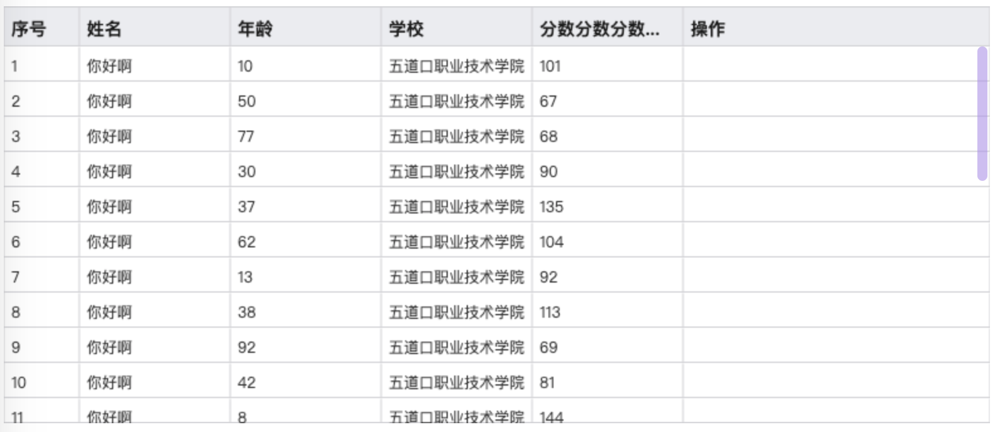

## 上万行数据渲染之终极方案：canvas-table

### 安装
```javascript
  npm i @phoenix_fan/canvas-table
```

### Vue中使用 
```javascript
<template>
  <div id="app"></div>
</template>

<script lang="ts" setup>
import CanvasTable from "@phoenix_fan/canvas-table";
/** 引入样式 */
import "@phoenix_fan/canvas-table/lib/index.css";

const columns = [
  { label: "序号", key: "index", width: 60 },
  { label: "姓名", key: "name", width: 120 },
  { label: "年龄", key: "age", width: 120 },
  { label: "学校", key: "school", width: 120 },
  { label: "分数分数分数分数分数分数分数分数", key: "source", width: 120 },
  { label: "操作", key: "options", minWidth: 120 },
]

const tableData = new Array(30).fill(null).map((v, i) => ({
  id: ~~(Math.random() * 999999999),
  index: i + 1,
  name: '你好啊',
  age: ~~(Math.random() * 99),
  school: '五道口职业技术学院',
  source: ~~(Math.random() * 150),
}))

const instance = new Table({
  el: "#app",
  data: tableData,
  columns,
})

</script>

```

### 浏览器中使用 
```html
<!DOCTYPE html>
<html lang="en">
	<head>
    <meta charset="UTF-8">
    <meta http-equiv="X-UA-Compatible" content="IE=edge">
    <meta name="viewport" content="width=device-width, initial-scale=1.0">
    <title>Canvas Table</title>
		<link rel="stylesheet" href="node_modules/@phoenix_fan/canvas-table/lib/index.css">
    <script src="node_modules/@phoenix_fan/canvas-table/lib/index.umd.js" ></script>
	</head>
	<body>
    <div id="app"></div>


		<script>
			const columns = [
        { label: "序号", key: "index", width: 60 },
        { label: "姓名", key: "name", width: 120 },
        { label: "年龄", key: "age", width: 120 },
        { label: "学校", key: "school", width: 120 },
        { label: "分数分数分数分数分数分数分数分数", key: "source", width: 120 },
        { label: "操作", key: "options", minWidth: 120 },
      ]

      const tableData = new Array(30).fill(null).map((v, i) => ({
        id: ~~(Math.random() * 999999999),
        index: i + 1,
        name: '你好啊',
        age: ~~(Math.random() * 99),
        school: '五道口职业技术学院',
        source: ~~(Math.random() * 150),
      }))

      const instance = new Table({
        el: "#app",
        data: tableData,
        columns,
      })
		</script>
	</body>
</html>

```

### 效果图


